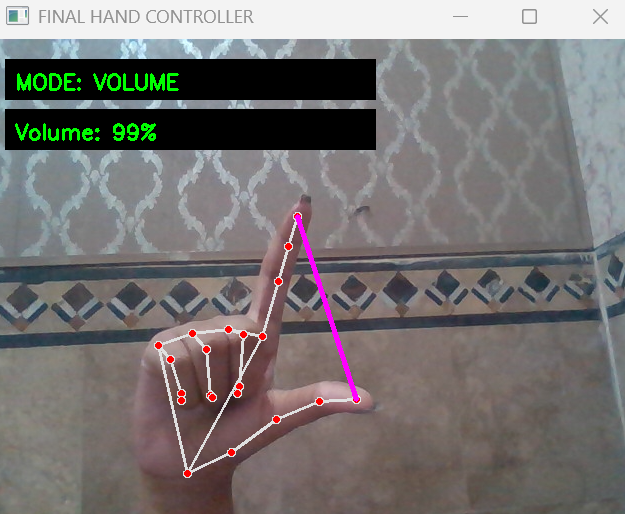
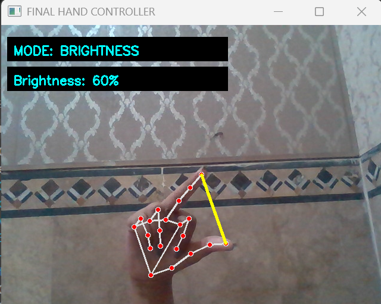
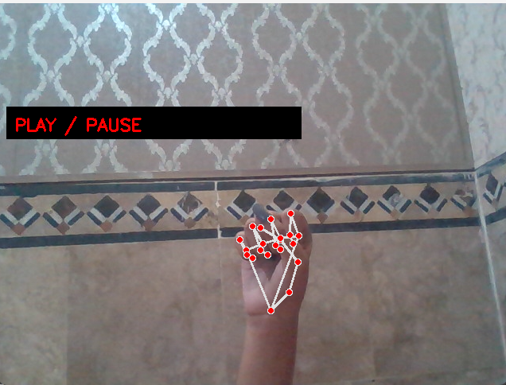
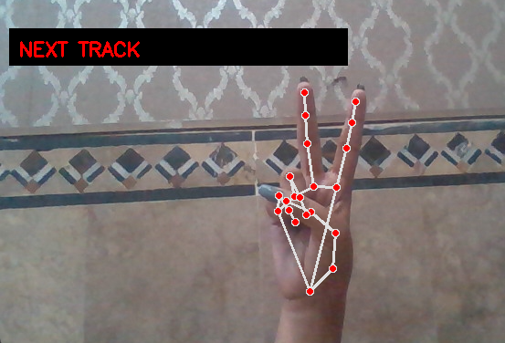

# Media_Controll_through_Hand
A real-time computer vision project that enables users to interact with their computer using hand gestures without physical contact. This system allows control of system functionalities such as volume, brightness, and media playback using Python, OpenCV, and MediaPipe.

---

##  Features

-  Control system volume using thumb + index finger distance
-  Control screen brightness using thumb + middle finger distance
-  Play / Pause media using fist gesture
-  Next track control using victory gesture
-  Touchless interaction using real-time hand tracking
-  Smooth and stable gesture detection with locking system
-  Low latency real-time performance

---

##  Tech Stack

- Python 
- OpenCV (Computer Vision)
- MediaPipe (Hand Tracking)
- Pycaw (System Audio Control)
- Screen Brightness Control Library
- PyAutoGUI (Keyboard Media Controls)

---

## Output Screenshots

### Volume Control Mode


### Brightness Control Mode


### Play / Pause Gesture


### Next Track Gesture


---

##  Installation

Clone the repository:

```bash
git clone https://github.com/SamanTarique/Media_Controll_through_Hand.git
cd Media_Controll_through_Hand
```
### Python Version

- This project was developed using:
**Python 3.10**

### Installation dependencies

```bash
pip install opencv-python mediapipe pycaw screen-brightness-control pyautogui comtypes
```

---

## Usage

Run the project:
```bash
python project.py
```
Make sure:

- Webcam is connected
- Good lighting is available
- Hand is clearly visible to camera

---

##  Gesture Controls
Gesture	Action:
- Fist ✊	-->                     Play / Pause media
-  Victory ✌️ -->                  Next track
- Thumb + Index distance -->      Volume control
- Thumb + Middle distance -->    	Brightness control

---

## How It Works
- Captures live video using OpenCV
- Detects hand landmarks using MediaPipe
- Calculates distances between specific fingers
- Maps gestures to system controls
- Executes system actions in real time
  
---
## Future Improvements
- Previous track gesture
- Mouse cursor control using hand tracking
- Scroll control (up/down gestures)
- Multi-hand support
- UI dashboard for controls

---

 #### Author
 Developed by Saman Tarique


